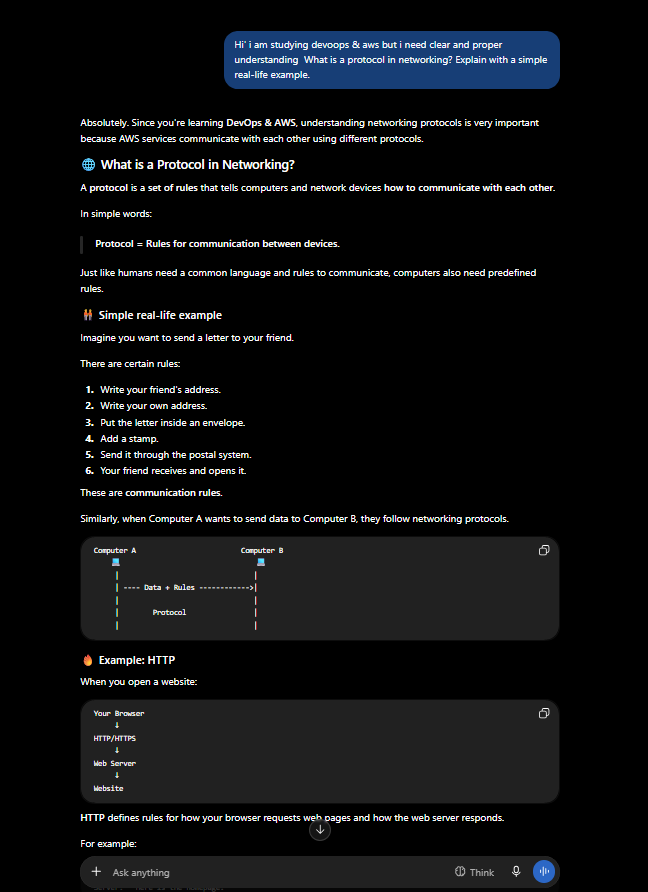
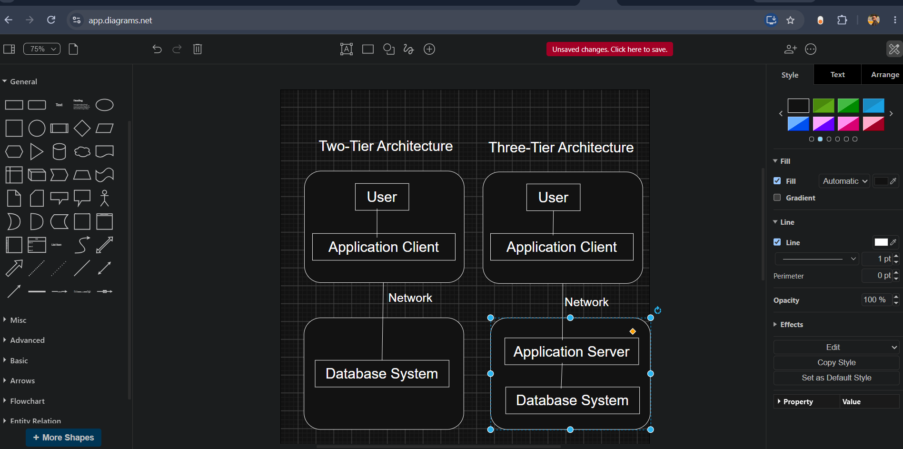
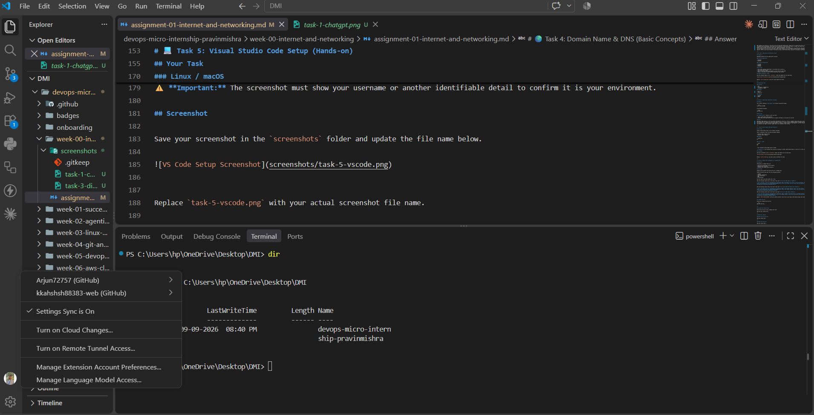

# Week 00 - Internet and Networking

Part of the DevOps Micro Internship (DMI) with Agentic AI

---

# 🧑‍💻 Task 1: Using ChatGPT as Your Learning Assistant

## Scenario

You're new to DevOps and will frequently encounter technical questions. ChatGPT can be your learning companion.

## Your Task

Write a clear ChatGPT prompt to help you understand:

> Hi' i am studying devoops & aws but i need clear and proper understanding  What is a protocol in networking? Explain with a simple real-life example.

Take a screenshot of your interaction showing:

* Your detailed prompt (with clear expectations)
* ChatGPT's simplified response with an example

## Screenshot

Save your screenshot in the `screenshots` folder and update the file name below.




Replace `task-1-chatgpt.png` with your actual screenshot file name.

---

## What I Learned (2–3 lines)

I learned that a networking protocol is a set of rule that allows computer and device to communicate with each other.I also learned that protocol like HTTP,HTTPS,TCP,IP,and DNS are used for different type of network communication.

---

# 🌐 Task 2: Internet and Networking

## Scenario

Your friend is launching an online bookstore named **EpicReads**.

He asked you to explain how users globally can access his website hosted in Finland.

## Your Task

Write a short explanation (**100–150 words**) that includes:

* Packet Switching
* IP Address
* TCP/IP
* HTTP/HTTPS

💡 **Tip:** You may use ChatGPT (as demonstrated in Task 1) to refine your explanation.

## Answer

When someone from any part of the world visite the epicreads website,their request has to travelto the server localed in finland.
The website has an IP address, which works like the address of the server.The request is broken into samll part called  packets and these packets travel throught different routers and  network using packet switching.
TCP/IP helps the user's device and the server communicate properly. IP is responsible for finding the right destination, while TCP makes sure the data reaches correctly and in the proper order. After reaching the server, HTTP or HTTPS is used to communicate between the browser and the website. HTTPS is more secure because it encrypts the data, which helps protect important information like passwords and payment details.

---

# 🏗️ Task 3: Application Architecture & Stack

## Scenario

EpicReads bookstore has two application versions:

### Two-Tier Application

* Frontend
* Database

### Three-Tier Application

* Frontend
* Backend
* Database

## Your Task

* Draw simple diagrams (hand-drawn or tool-based such as draw.io)
* Label each layer clearly
* List at least two common technologies or tools used for each layer
* Submit a screenshot or photo clearly showing your own drawing

## Diagram Screenshot / Photo

Save your diagram image in the `screenshots` folder and update the file name below.




Replace `task-3-diagram.png` with your actual diagram file name.

---

## Technologies Used

### Frontend

* HTML.
*  Core CSS or TAILWIND CSS.
* JAVASCRIPT or REACT.

### Backend

* Node js
* Express js

### Database

* MongoDB
* MySQL

---

# 🌍 Task 4: Domain Name & DNS (Basic Concepts)

## Scenario

Your friend's bookstore **EpicReads** is currently accessible through:

```text
52.172.142.222:3000
```

He purchased the domain:

```text
epicreads.com
```

## Your Task

In **50–100 words**, explain in your own words:

1. What is DNS (Domain Name System)?
2. Which DNS record type should be used to connect the domain to the given IP, and why?

## Answer

DNS(Domain Name System) is like the internet phonebook.It converts an  easy to remember domain name such as epicreads.com into the IP address of the server where the website is hosted.This makes it easier for users to access websites without remembering numbers.
For EpicReads, an A record should be used because it connects a domain name to an IPv4 address. So, the A record can point epicreads.com to 52.172.142.222. The :3000 is the port number and is not included in the A record.

---

# 💻 Task 5: Visual Studio Code Setup (Hands-on)

## Your Task

Install Visual Studio Code (if not already installed).

Take a screenshot of your VS Code environment showing:

* Terminal open inside VS Code
* Running a basic command:

### Windows

```powershell
dir
```

### Linux / macOS

```bash
pwd
ls
```

* Your selected VS Code theme clearly visible

⚠️ **Important:** The screenshot must show your username or another identifiable detail to confirm it is your environment.

## Screenshot

Save your screenshot in the `screenshots` folder and update the file name below.




Replace `task-5-vscode.png` with your actual screenshot file name.

---

# 🔗 Task 6: Publish Your Assignment as a LinkedIn Post

## Objective

Publishing on LinkedIn helps you:

* Build your professional online presence
* Reinforce your learning
* Document your DevOps journey publicly

## Your Task

Summarize your answers from Tasks 1–5 into a LinkedIn post.

Clearly structure your post into the following sections:

* ChatGPT
* Internet & Networking
* App Architecture
* DNS
* VS Code Setup

Use the credit note that matches your track:

Add the following credit note at the end of your post **(If you are DMI Cohort 3 student)**:

> **P.S. This post is part of the DevOps Micro Internship (DMI) with Agentic AI — Cohort 3 — by Pravin Mishra. My graded progress is public: https://dmi.pravinmishra.com/s/YOUR-GITHUB-USERNAME.html · Start your DevOps journey: https://dmi.pravinmishra.com/?utm_source=student&utm_medium=ps-linkedin&utm_campaign=cohort3**

**Tag [Pravin Mishra](https://www.linkedin.com/in/pravin-mishra-aws-trainer/) in your LinkedIn post, then tag Lead Co-Mentor — [Anjana Muthunayake](https://www.linkedin.com/in/anjana-muthunayake/).**

Add the following credit note at the end of your post **(If you are DMI Self-paced track student)**:

> **P.S. This post is part of the DevOps Micro Internship (DMI) — Self-Paced Engineer Track — by Pravin Mishra. My graded progress is public: https://dmi.pravinmishra.com/s/YOUR-GITHUB-USERNAME.html · Start your DevOps journey: https://dmi.pravinmishra.com/?utm_source=student&utm_medium=ps-linkedin&utm_campaign=self-paced**

Add the following credit note at the end of your post **(If you are DMI Campus student)**:

> **P.S. This post is part of the DevOps Micro Internship (DMI) — Campus — by Pravin Mishra. My graded progress is public: https://dmi.pravinmishra.com/s/Arjunchoudhary2027.html · Start your DevOps journey: https://dmi.pravinmishra.com/?utm_source=student&utm_medium=ps-linkedin&utm_campaign=campus**

**Tag [Pravin Mishra](https://www.linkedin.com/in/pravin-mishra-aws-trainer/) in your LinkedIn post, then tag Lead Co-Mentor — [Anjana Muthunayake](https://www.linkedin.com/in/anjana-muthunayake/).**

Hashtags:

#DMIByPravinMishra #AgenticAI #DevOps

Replace `YOUR-GITHUB-USERNAME` with your GitHub username — that link is your public DMI progress page (your graded badge page).
---

## LinkedIn Post URL

Paste your LinkedIn post URL here:

```text
https://www.linkedin.com/posts/arjun-choudhary-40b070282_devops-aws-networking-activity-7505536462482817025-HfQ6?utm_source=share&utm_medium=member_desktop&rcm=ACoAAES1WUsBWzyWP3lxPiB6LHc6dUaZRHDaG08
```

---

## LinkedIn Post Backup Copy

Week 00 – DevOps Micro Internship (DMI) | Cohort 3
I’ve completed my Week 00 – Internet and Networking tasks as part of my DevOps learning journey.
Here’s what I learned and practiced this week:
 ChatGPT
I learned how networking protocols work and how they help devices communicate with each other. I also understood the concept using a simple real-life example.
 Internet & Networking
I learned how a website hosted in Finland can be accessed by users around the world. I explored packet switching, IP addresses, TCP/IP, and HTTP/HTTPS and understood how they work together when accessing a website.
 App Architecture
I learned the difference between two-tier and three-tier application architecture.
I also explored technologies commonly used in each layer:
Frontend: HTML, CSS, JavaScript, React
Backend: Node.js, Express.js
Database: MongoDB, MySQL
 DNS
I learned that DNS (Domain Name System) works like the internet's phonebook. It converts a domain name into an IP address.
I also learned that an A record is used to connect a domain name with an IPv4 address.
VS Code Setup
I practiced using Visual Studio Code and its integrated terminal. I also ran basic commands and became more comfortable working with the development environment.
This week helped me strengthen my basic networking and DevOps concepts. I'm looking forward to learning more about Linux, Git, AWS, cloud infrastructure, and automation in the upcoming weeks. 
hashtag#DevOps hashtag#AWS hashtag#Networking hashtag#CloudComputing hashtag#Learning hashtag#DMI hashtag#DevOpsMicroInternship hashtag#Cohort3 hashtag#AgenticAI hashtag#TechLearning hashtag#DMIBbyPravinMishra

 P.S. This post is part of the DevOps Micro Internship (DMI) — Self-Paced Engineer Track — by Pravin Mishra. My graded progress is public: https://lnkd.in/dhgCBiuw · Start your DevOps journey: https://lnkd.in/drJ5hj7w

---

# Reflection – Week 0

### What did you find easy?

I found the basic networking concepts easy to understand , especially IP addresses, DNS, and networking protocols. The real-life example made these concept easier to understand.

---

### What was difficult?

Understanding how packets travel through different networks and how TCP/IP works was a little difficult at first. I needed to go through the concepts more than once to understand them properly.

---

### What will you improve next week?

Next week, I want to improve  Git skills and start learning more about AWS and DevOps tools. I also want to practice the concepts instead of only studying the theory.

---

## 📌 About DMI & CloudAdvisory

DevOps Micro Internship (DMI) is a project-based DevOps program run by Pravin Mishra (The CloudAdvisory) focused on real-world execution, systems thinking, and career readiness.

It helps learners build strong DevOps foundations with hands-on experience.


## 📌 Resources

- 🌐 **DMI Official Website:** https://dmi.pravinmishra.com?utm_source=github&utm_medium=readme  
- 🎓 **University:** https://university.pravinmishra.com?utm_source=github&utm_medium=readme  
- 💬 **Discord Community:** https://discord.pravinmishra.com?utm_source=github&utm_medium=readme  
- 📝 **Blog:** https://dmi.pravinmishra.com/blog?utm_source=github&utm_medium=readme  
- ▶️ **YouTube Playlist (DMI Cohort 3):** https://www.youtube.com/playlist?list=PLFeSNDtI4Cho  
- 🔗 **Pravin Mishra (LinkedIn):** https://www.linkedin.com/in/pravin-mishra-aws-trainer/  
- 🏢 **CloudAdvisory (LinkedIn):** https://www.linkedin.com/company/thecloudadvisory/

---

*This submission is part of DevOps Micro Internship (DMI) — Agentic AI Track*