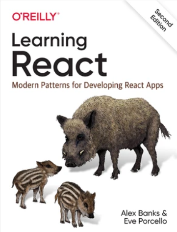
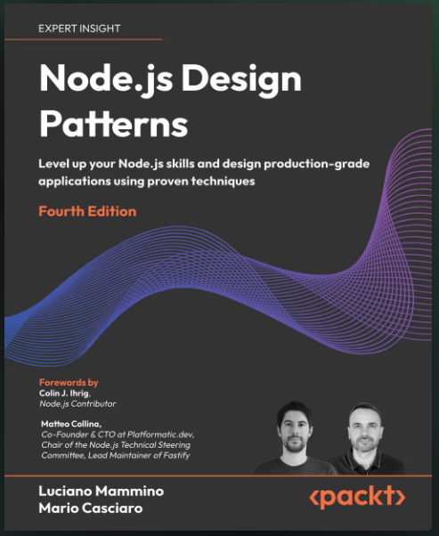
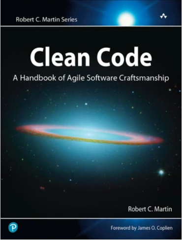
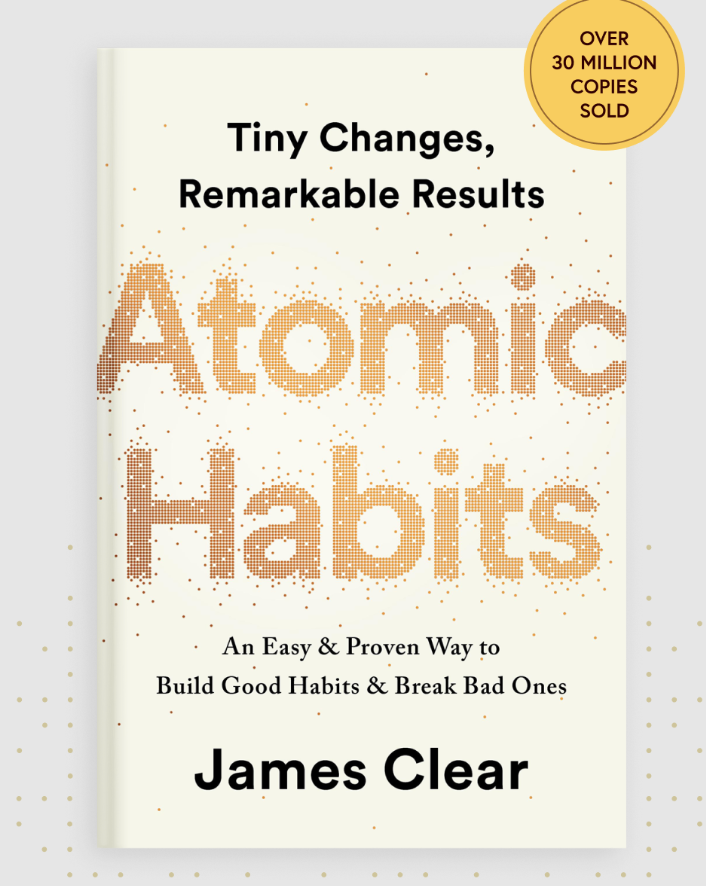
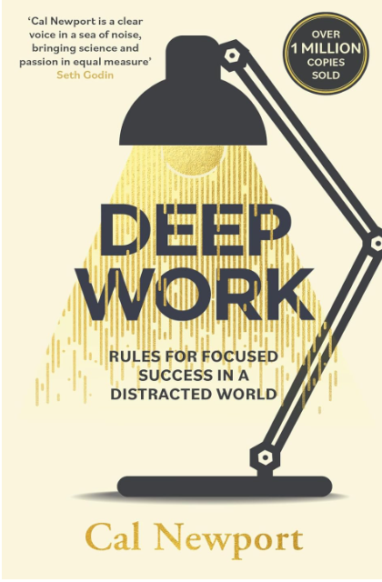
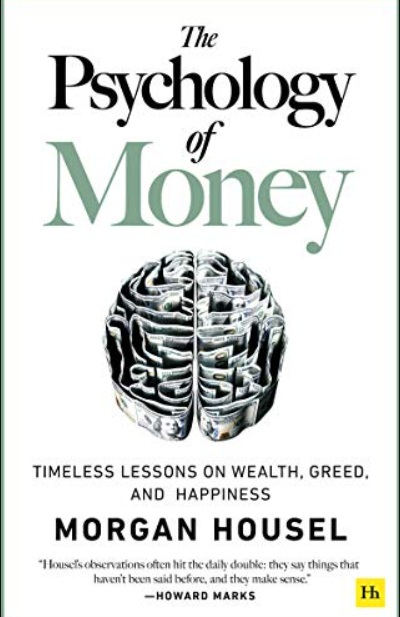

# Week 01 — Success Mindset (Mindset OS)

Part of the DevOps Micro Internship (DMI) with Agentic AI

---

## Purpose (Read This First)

This week is not motivation homework.

This is you building your **Mindset OS** — the system you will use for the next 5 months (and honestly, for years).

### Expectations

* Be honest.
* Be specific.
* Be practical.
* Write like an adult professional: clear sentences, no one-liners.

You will reuse this in later weeks. So do it properly once.

---

# Assignment 1. What is something you believe to be true that most people around you would disagree with?

### Rules

* No "safe" answers.
* Must be your real belief (not copied from internet).
* Minimum 50 words.

**Hint:** What do you believe about career, money, learning, discipline, relationships, health, success, life, tech industry, etc. that most people don't agree with?

## Answer

I believe that getting a good job is not the same as having a successful career. Many people around me think that getting a degree and joining a well-known company means you have achieved success. I disagree with that i think real success comes from continuously learning and improving  your skills. Even if someone start with a small job or a lower salary they can build a better career if they keep learning ,gaining practical experience and taking new opportunities. For me,skills,consistency,and willingness to learn are more important than just the name of the company or the starting salary.

---

# Assignment 2. What are the top 3 objective truths you discovered through experimentation and results?

### Definition

Objective truths do not depend on opinions. They hold true regardless of how people feel.

Write each truth in this format:

**Truth:** (1 sentence)

**Evidence from my life:** (2–4 lines: what you tried + what happened)

---

## Truth #1

### Truth

Regular pracice improve my coding skills more than only watching tutorials.

### Evidence from my life

I tried learning HTML,CSS and JavaScript by building small projects instead of only watching videos. When i practised by making things like a calculator and a TO-DO-list, I understood concept better and became more confident in writing code.

---

## Truth #2

### Truth

I remember technical concepts better when i understand them with practcal examples.

### Evidence from my life

I notice that reading defination alone made sme networking and DevOps concepts difficults to remember.
When I learned concepts such as protocols,DNS,IP addresses, and TCP/IP using real-life examples, they become much easier for me to understand and explain.

---

## Truth #3

### Truth

Consistent effort over time produces better results than studying a lot only once in a while.

### Evidence from my life

I tried spending regular time learning programming and DevOps concepts instead of studyng everything at once.
Even when I learned only one small topic at a time, I found that my understanding gradually improved and I could connect new topics with what I had already learned.

---

# Assignment 3. What does your 2.0 version look like?

### Instructions

Write as if a journalist is writing about you **3 to 7 years from now** (not 20 years).

**Minimum 300 words.**

### Rules

* Write in past tense, like it already happened.
* Don't use "likes to / wants to / hopes to."
* Use specifics:

  * built
  * shipped
  * led
  * published
  * earned
  * relocated
  * contributed
* Include skills proof:

  * projects
  * portfolios
  * GitHub
  * blogs
  * certifications
  * job role
  * leadership
  * community contribution
* Add 1–3 images if you can (optional but powerful).

### Publish It Publicly On Any ONE

* LinkedIn
* Medium
* WordPress
* Blogspot
* Personal blog
* Portfolio page

Use the credit note that matches your track:

Add the following credit note at the end of your post **(If you are DMI Cohort 3 student)**:

> **P.S. This post is part of the DevOps Micro Internship (DMI) with Agentic AI — Cohort 3 — by [Pravin Mishra](https://www.linkedin.com/in/pravin-mishra-aws-trainer/). My graded progress is public: https://dmi.pravinmishra.com/s/Arjunchoudhary2027.html · Start your DevOps journey: https://dmi.pravinmishra.com/?utm_source=student&utm_medium=ps-blog&utm_campaign=cohort3**

**Tag [Pravin Mishra](https://www.linkedin.com/in/pravin-mishra-aws-trainer/) in your LinkedIn post, then tag Lead Co-Mentor — [Anjana Muthunayake](https://www.linkedin.com/in/anjana-muthunayake/).**

Add the following credit note at the end of your post **(If you are DMI Self-paced track student)**:

> **P.S. This post is part of the DevOps Micro Internship (DMI) — Self-Paced Engineer Track — by [Pravin Mishra](https://www.linkedin.com/in/pravin-mishra-aws-trainer/). My graded progress is public: https://dmi.pravinmishra.com/s/YOUR-GITHUB-USERNAME.html · Start your DevOps journey: https://dmi.pravinmishra.com/?utm_source=student&utm_medium=ps-blog&utm_campaign=self-paced**

Add the following credit note at the end of your post **(If you are DMI Campus student)**:

> **P.S. This post is part of the DevOps Micro Internship (DMI) — Campus — by [Pravin Mishra](https://www.linkedin.com/in/pravin-mishra-aws-trainer/). My graded progress is public: https://dmi.pravinmishra.com/s/YOUR-GITHUB-USERNAME.html · Start your DevOps journey: https://dmi.pravinmishra.com/?utm_source=student&utm_medium=ps-blog&utm_campaign=campus**

**Tag [Pravin Mishra](https://www.linkedin.com/in/pravin-mishra-aws-trainer/) in your LinkedIn post, then tag Lead Co-Mentor — [Anjana Muthunayake](https://www.linkedin.com/in/anjana-muthunayake/).**

Hashtags:

#DMIByPravinMishra #AgenticAI #DevOps

## Your Article

Three years ago, I was just a student who had started getting serious about web development. I was learning HTML, CSS, JavaScript, React, Node.js, Express.js, and MongoDB. I understood the basics, but making a complete project by myself was not easy. I got stuck many times, searched for answers, fixed errors, and slowly learned from those mistakes.

Three years later, my 2.0 version had become a professional MERN Stack Developer.

During these three years, I built and shipped different full-stack web applications using MongoDB, Express.js, React, and Node.js. I worked on projects like an e-commerce website, authentication systems, admin dashboards, and REST API-based applications. Building these projects helped me understand how the frontend, backend, database, and APIs actually work together.

My GitHub profile also changed a lot. Earlier, it was mostly for uploading practice code. Later, it became a proper portfolio where I had complete projects, README files, documentation, and regular contributions. Each project showed my skills and the problems I had solved while building it.

I also created and published my own developer portfolio website. It included my skills, projects, GitHub profile, certifications, and contact details. I started writing technical blogs too, where I shared things I learned about JavaScript, React, Node.js, MongoDB, APIs, Git, and deployment.

Along the way, I earned some web development and technology certifications and used my projects as proof of my practical skills. I also became more active in developer communities. I helped beginners, shared useful resources, answered questions, and learned from other developers.

I also started working professionally as a MERN Stack Developer. I worked on real projects, added new features, fixed bugs, created APIs, worked with databases, and collaborated with other developers. With more experience, I started taking responsibility for development tasks and handling parts of projects on my own.

The biggest change, however, was not just my technical skills. My problem-solving skills improved a lot. I became more comfortable reading documentation, debugging errors, understanding code written by others, and breaking bigger problems into smaller ones.

My 2.0 version was not built in one day. It came from regular practice, real projects, mistakes, debugging, and continuous learning.

Three years earlier, I was a student trying to understand how websites worked. Three years later, I had become a developer who could build, deploy, and maintain full-stack applications.

Looking back, my journey from student developer to professional MERN Stack Developer taught me a simple lesson: if you keep improving a little every day, you can become a completely different version of yourself after three years.

### Public Link

Paste your link here:

https://medium.com/@studyplace16/mern-journey-dd9c38dcc75c?postPublishedType=initial

---

# Assignment 4. Have you ever cut corners (unethical / dishonest / shortcut behavior — not necessarily illegal)? If yes, how did it make you feel?

### Important

You don't need to write the full story.

Focus on the feeling:

* guilt
* fear
* shame
* stress
* regret
* numbness
* etc.

This is about self-awareness, not judgment.

### Answer Format

**Yes / No**

If Yes:

**What emotion did you feel?** (minimum 50–100 words)

## Answer

Yes' I have taken shortcut before, especially when i was under pressure to finish something quickly. At that moment, it felt like an easy way to save time ,but later i felt guilty and stressed about it .I keep thinking that i could have done the work properly insteand of looking for an easier way. It also made me feel uncomfortable because i knew that the shortcut was not the right approch. The experience taught me that finishing something quickly is not always more important that doing it honestly and learning from the process. Since then, I have tried to be more responsible and avoid repeating the same mistake.

---

# Assignment 5. What are 10 non-fiction books you plan to read in the next 1 year?

### Rules

* Mention **Title + Author**
* Any language allowed
* No fiction novels

### Tip

Choose books that improve:

* mindset
* communication
* productivity
* health
* money
* career
* leadership

## Book List

1.Learning React-Alex Banks & Eve Porcello

2. Node.js Design Patterns- Mario Casciaro & Luciano Mammino.

3. MongoDB-Shannon Bradshaw, Ecin Brazil & Kristina

4. Clean Code — Robert C. Martin

5. Atomic Habits — James Clear

6. Deep Work — Cal Newport

7. The Psychology of Money — Morgan Housel

---

# Assignment 6. What are the things you will measure regularly in your life and career?

### Rules

List topics only. No need to share numbers.

### Must Include

* Learning / skill
* Output / proof
* Health / energy
* Time / focus
* Money / finance (personal or business)

### Example

* Learning hours per week
* Deep work sessions per week
* Projects shipped / documented
* Steps / workouts
* Sleep hours
* Spending tracker

## My Metrics

* Learning hours per week
* MERN/technical skills practiced
* New concepts learned
* Coding practice sessions
* Projects completed and shipped
* GitHub contributions and projects update
* Deep work sessions per week
* Sleep hours and overall energy
* Workouts/ physical activity
* Monthly Spending and expenses

---

# Assignment 7. Brain Dump + 5-Month System Plan

## Step 1: Brain Dump (Private)

Do a brain dump of everything in your mind into a notebook.

Examples:

* Bills
* Tasks
* Worries
* Goals
* Pending messages
* Ideas
* Responsibilities

### Did You Do It?

**Yes / No**

Answer:

Yes'I wrote down the important things that were on my mind, including my studies, MERN development learning, DMI tasks, projects, career goals, pending work, and other responsibilities.

---

## Step 2: Your 5-Month Routine + Focus Blocks

Create a simple plan you can realistically follow for the next 5 months.

### Weekly Routine

Example:

* Mon–Thu: 60 min deep work
* Sat: DMI session
* Sun: Weekly review

#### My Weekly Routine

Monday–Thursday: 1 hour MERN development practice.
Friday: 1 hour DMI work and revision.
Saturday: 2 hours for projects and coding practice.
Sunday: Weekly review and planning for the next week.

---

### Focus Blocks

#### When Will You Do DMI Work? (Days + Time)

Friday: 7:00 PM - 8:00 PM
Saturday:10:00 AM-11:00 AM

#### How Many Sessions Per Week?

1 sessions per week

---

### Distraction Rules

Examples:

* Phone rules
* Social media rules
* Environment setup

#### My Distraction Rules

1. Keep my phone away during study and coding sessions.
2. Avoid Instagram, YouTube Shorts, and unnecessary social media during focus time.
3. Use only the tabs and websites needed for learning.
4. Study in a clean and quiet place.
5. Complete my planned task before taking a long break.
6. Avoid multitasking while coding or studying.

---

# Reflection – Week 1

### Biggest insight I got about myself this week

I realized that I can learn better when I follow a proper routine instead of trying to do everything at once. Small and consistent progress helps me stay focused and understand things better.

### My biggest weakness/loop I noticed

My biggest weakness is getting distracted by my phone and sometimes spending too much time watching tutorials instead of actually practicing and building something.

### One system I will implement from this week (exact habit + time)

I will keep a 1-hour coding and learning block from 7:00 PM to 8:00 PM, Monday to Thursday, with my phone away. During this time, I will focus only on MERN development, DMI work, or project practice.

### LinkedIn Post

Paste your LinkedIn post link  here:

https://www.linkedin.com/posts/arjun-choudhary-40b070282_devops-dmi-devopsmicrointernship-activity-7505685240443580416-UyCe?utm_source=share&utm_medium=member_desktop&rcm=ACoAAES1WUsBWzyWP3lxPiB6LHc6dUaZRHDaG08

---

## 10. Proof of Work

- LinkedIn Post URL:https://www.linkedin.com/posts/arjun-choudhary-40b070282_devops-dmi-devopsmicrointernship-activity-7505685240443580416-UyCe?utm_source=share&utm_medium=member_desktop&rcm=ACoAAES1WUsBWzyWP3lxPiB6LHc6dUaZRHDaG08

- Blog / Medium : https://medium.com/@studyplace16/building-my-mindset-os-lessons-from-week-01-0b4dc805b340

---

## 📌 About DMI & CloudAdvisory

DevOps Micro Internship (DMI) is a project-based DevOps program run by Pravin Mishra (The CloudAdvisory) focused on real-world execution, systems thinking, and career readiness.

It helps learners build strong DevOps foundations with hands-on experience.

## 📌 Resources

- 🌐 **DMI Official Website:** https://dmi.pravinmishra.com?utm_source=github&utm_medium=readme  
- 🎓 **University:** https://university.pravinmishra.com?utm_source=github&utm_medium=readme  
- 💬 **Discord Community:** https://discord.pravinmishra.com?utm_source=github&utm_medium=readme  
- 📝 **Blog:** https://dmi.pravinmishra.com/blog?utm_source=github&utm_medium=readme  
- ▶️ **YouTube Playlist (DMI Cohort 3):** https://www.youtube.com/playlist?list=PLFeSNDtI4Cho  
- 🔗 **Pravin Mishra (LinkedIn):** https://www.linkedin.com/in/pravin-mishra-aws-trainer/  
- 🏢 **CloudAdvisory (LinkedIn):** https://www.linkedin.com/company/thecloudadvisory/

---

*This submission is part of DevOps Micro Internship (DMI) — Agentic AI Track*